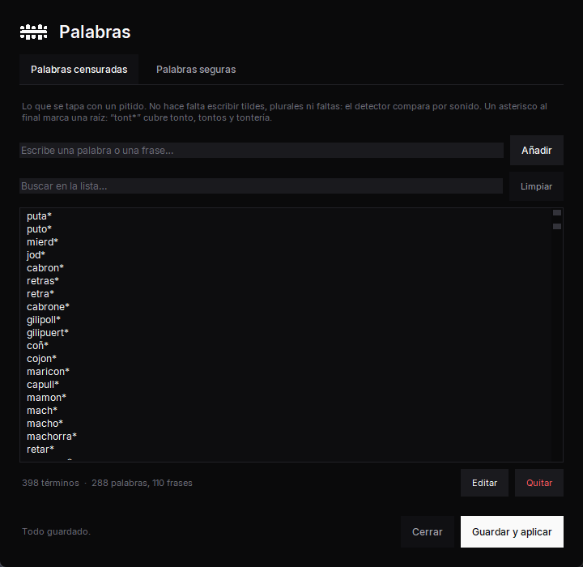

<p align="center">
  
</p>

<p align="center">
  <strong>Censor de audio en tiempo real para directos.</strong><br>
  Escucha lo que dices, reconoce las palabras que tú elijas y las tapa con un
  sonido antes de que salgan a la emisión.
</p>

<p align="center">
  
  
  
  
</p>

<p align="center">
  <a href="#descargar">Descargar</a> ·
  <a href="#cómo-funciona">Cómo funciona</a> ·
  <a href="#stack-tecnológico">Stack tecnológico</a> ·
  <a href="#qué-trae">Qué trae</a> ·
  <a href="#uso-diario">Uso diario</a> ·
  <a href="README.md">🇬🇧 English</a>
</p>

---

Un insulto en directo puede costar un canal, y cuando la emisión **es** el
producto no hay postproducción donde meter el pitido. BEEP STREAM se coloca entre
el micrófono y OBS: guarda tu voz durante segundo y medio, la va transcribiendo, y
si aparece una palabra de tu lista sustituye justo ese fragmento por un sonido
suave antes de que llegue a nadie.

Todo se ejecuta en local y en CPU. Sin API, sin cuenta, sin conexión.

<p align="center">
  
  
</p>

---

## Descargar

**[⬇ Descargar el instalador](../../releases/latest)** — lo ejecutas y ya está. No
pide permisos de administrador, crea los accesos directos y deja su desinstalador.

También necesitas [VB-CABLE](https://vb-audio.com/Cable/), que es gratuito. El
programa detecta solo si lo tienes instalado y te lleva a él si no.

La primera vez que lo abras se abre una guía de siete pasos que lo explica todo
con dibujos: qué es VB-CABLE, por qué hay retardo, qué tocar en OBS y cómo cuadrar
el vídeo con la voz.

---

## Cómo funciona

Windows no deja meter un programa entre un micrófono y otra aplicación, así que el
audio da un rodeo por un cable virtual:

```
micrófono ──► BEEP STREAM ──► CABLE Input ══╗
                                            ║  VB-CABLE
              OBS ◄── CABLE Output ═════════╝
```

Dentro, la señal se parte en dos caminos que no se bloquean entre sí:

| Camino | Qué hace |
|---|---|
| **Audio** | Guarda cada bloque que entra en un buffer circular y lo saca 1500 ms después. Ese retardo es todo el truco: compra tiempo para decidir antes de que el audio salga sin remedio. |
| **Reconocimiento** | Coge una copia, la baja de 48 a 16 kHz y se la pasa a Vosk, que devuelve cada palabra con su inicio y su final. Lo que coincide se apunta como un tramo; cuando el cursor de reproducción llega ahí, el contenido del buffer se sustituye por el sonido de censura. |

El reconocimiento va en su propio hilo, así que una transcripción lenta se traduce
en una palabra que se escapa, nunca en un corte en la emisión.

### Por qué 1500 ms

Vosk tarda hasta **830 ms** en confirmar una palabra, y el reconocedor trabaja con
tres ventanas solapadas de **800 ms** (que detectan más que cuatro de 600 gastando
un 26 % menos de CPU). 830 + 800 marca el suelo; con 1500 ms quedan unos 670 ms de
margen. El programa avisa antes de arrancar si bajas de ahí.

### No pitar sobre palabras inocentes

Un modelo de voz pequeño oye mal a menudo. Comparar literalmente se pierde
`"joer"` por `"joder"`; comparar a lo ancho pita sobre `"pescado"`. Por eso la
comparación es **fonética**: una clave pensada para el castellano que iguala
`b/v`, `y/ll`, `c/k/q`, la `h` muda y el seseo `s/z/c`, más distancia de edición
acotada, en tres niveles de sensibilidad. Una segunda lista guarda las palabras
normales que chocan fonéticamente con una censurada y las deja pasar.

La asimetría es a propósito: un falso negativo cuesta un canal, un falso positivo
cuesta un pitido incómodo.

---

## Stack tecnológico

| | |
|---|---|
| **Lenguaje** | Python 3.11 |
| **Reconocimiento de voz** | [Vosk](https://alphacephei.com/vosk/) 0.3.45 — offline, en CPU, con marcas de tiempo por palabra (modelo de español, 40 MB) |
| **Entrada y salida de audio** | [sounddevice](https://python-sounddevice.readthedocs.io/) (PortAudio / WASAPI) para micrófono y salida |
| **Audio del PC** | [PyAudioWPatch](https://github.com/s0d3s/PyAudioWPatch) — captura loopback de WASAPI, que PortAudio no expone |
| **Procesado de señal** | NumPy: buffer circular, filtro antialiasing, diezmado, mezcla y síntesis del tono |
| **Interfaz** | Tkinter más un kit de componentes propio (`widgets.py`), tokens de diseño monocromos (`tema.py`), y logo y diagramas dibujados en lienzo |
| **Tipografía** | [Inter](https://rsms.me/inter/), empaquetada y registrada solo para el proceso: no se instala nada en el sistema |
| **Bandeja del sistema** | Win32 puro con `ctypes` — sin dependencias extra |
| **Integración con Windows** | `ctypes`: AppUserModelID, iconos, DPI y barra de título oscura |
| **Empaquetado** | PyInstaller (onedir) + [Inno Setup](https://jrsoftware.org/isinfo.php) 6 |
| **Recursos gráficos** | Pillow, solo al compilar — iconos, banner y capturas se generan desde código |

Cuatro dependencias en ejecución. Todo lo demás —interfaz, WAV, JSON, hilos, icono
de bandeja— es librería estándar de Python, para no inflar el ejecutable.

---

## Qué trae

- **Dos censores independientes.** El micrófono, y el audio del PC (juego, voz,
  música) captado por loopback de WASAPI: no hay que enrutar nada y tú no notas
  retardo. Cada uno tiene su motor y su hilo, así que si uno se cae el otro sigue.
- **Editor de palabras integrado.** Las dos listas, con buscador, altas, bajas y
  correcciones. Se aplica al momento, aunque estés emitiendo. El fichero conserva
  sus comentarios y categorías, así que editarlo a mano sigue valiendo.
- **Los fallos se ven.** Un censor que se para en silencio es peor que no tener
  ninguno, porque te crees protegido. El programa vigila que no se muera el hilo
  de reconocimiento, que el flujo de audio no se pare sin dar error, y que el
  micrófono no esté abierto pero mudo. Los tres salen en rojo, el único color de
  toda la interfaz.
- **Modo prueba.** Graba 8 segundos y te deja comparar el antes y el después sin
  emitir nada.
- **Modo rendimiento.** Esconde la ventana en la bandeja; el censor sigue.
- **Seis sonidos de censura**, tema claro y oscuro, y todo configurable.

<p align="center">
  
</p>

---

## Uso diario

| Botón | Qué hace |
|---|---|
| **INICIAR** | arranca el censor |
| **CENSOR ON / OFF** | deja pasar el audio sin filtrar, sin parar nada |
| **MUTE** | silencia el micrófono del todo |
| **MODO PRUEBA** | graba 8 s y te deja comparar antes de emitir |
| **MODO RENDIMIENTO** | esconde la ventana en la bandeja del reloj |
| **GUÍA DE INSTALACIÓN** | vuelve a abrir la guía de los siete pasos |

Mientras emites, lo que hay que mirar es la cabecera:

| Estado | Significa |
|---|---|
| `● ACTIVO` | todo correcto, censurando |
| `● PARADO` | no hay nada en marcha |
| `○ SIN CENSURA` | el audio pasa sin filtrar (lo has apagado tú) |
| `● SILENCIADO` | el micrófono está cerrado |
| `● FALLO` | **estás emitiendo sin filtrar sin quererlo** |

### Tus palabras

En **CENSURA › Palabras › Editar lista**. Una palabra o frase por línea, y un
asterisco al final cubre todo lo que empiece igual:

```
tonto            solo "tonto"
tont*            tonto, tontos, tontaco, tontería...
me cago en todo  también valen frases
```

La pestaña **Palabras seguras** es lo contrario: palabras normales que suenan
parecido a una censurada y que **no** hay que tapar. Sirve para quitar falsos
positivos sin bajar la sensibilidad general.

### Si algo no va

**No aparece CABLE Input** — VB-CABLE no está instalado, o falta reiniciar Windows
después de instalarlo.

**El nivel no se mueve** — el micrófono está silenciado (en los auriculares con
brazo, subir el brazo los silencia) o Windows no da permiso: *Configuración ›
Privacidad y seguridad › Micrófono › permitir a las aplicaciones de escritorio*.

**Se escapan palabras** — sube el retardo, comprueba que la palabra esté en la
lista y prueba el modo `agresivo` en `config.json`.

**Pita sobre palabras normales** — añádela a *Palabras seguras* y guarda.

**Me oigo con retraso** — estás escuchando la salida del cable. La monitorización
tiene que ir directa al micrófono, no pasar por BEEP STREAM.

**"Unanticipated host error"** — otro programa tiene el micrófono en exclusiva, o
unos auriculares inalámbricos se han dormido. El programa prueba el mismo aparato
por todas las APIs de Windows antes de rendirse.

---

## Desde el código

```bash
git clone https://github.com/airamfuentes/beepstream
cd beepstream
instalar.bat          # dependencias + modelo de español de Vosk (~40 MB)
BeepStream.bat        # arrancar
```

Hace falta Python 3.11 en Windows 10 o posterior.

**Generar el instalador:**

```bash
construir.bat                  # PyInstaller + Inno Setup -> publicar\
construir.bat sininstalador    # solo la carpeta portable
```

**Pruebas** — las cuatro primeras no necesitan micrófono ni modelo:

```bash
py -3.11 tests/test_matcher.py            # coincidencia fonética
py -3.11 tests/test_engine.py             # buffer, DSP, lógica de tramos
py -3.11 tests/test_falsos_positivos.py   # audita la lista real de palabras
py -3.11 tests/test_interfaz.py           # paleta, tipografía, ventanas
py -3.11 tests/test_integracion.py        # audio -> Vosk -> detección -> pitido
py -3.11 tests/test_audio.py              # abre dispositivos de verdad
py -3.11 tests/test_cable.py              # extremo a extremo por VB-CABLE
```

### Estructura

```
main.py            arranque, argumentos, modo consola
├── gui.py         ventana principal
│   ├── widgets.py componentes con tema (tarjetas, botones, medidores)
│   ├── tema.py    paleta monocroma, escala tipográfica y espaciado
│   ├── marca.py   geometría del logo, compartida con el generador de iconos
│   ├── fuentes.py carga Inter solo para el proceso
│   ├── sistema.py Windows: identidad, iconos, DPI y barra de título
│   ├── asistente.py   guía de primer arranque, diagramas en lienzo
│   ├── palabras.py    editor de las listas
│   └── listas.py      lectura y escritura respetando los comentarios
├── engine.py      buffer circular, núcleo del censor, motor del micrófono
├── escritorio.py  segundo motor: audio del PC por loopback de WASAPI
├── recognizer.py  envoltorio de Vosk, diezmado y ganancia
├── matcher.py     coincidencia fonética y lista de palabras seguras
├── beeper.py      síntesis del sonido de censura (6 estilos) y WAV
├── dispositivos.py  resolución de dispositivos entre MME/DirectSound/WASAPI
├── bandeja.py     icono de bandeja con Win32 puro
├── config.py      config.json con valores por defecto y migración
└── rutas.py       rutas distintas para código y ejecutable empaquetado
```

---

## Privacidad

El reconocimiento es offline y funciona sin conexión. No se graba ni se envía
nada. Los únicos ficheros que se escriben son `config.json` y, si usas el modo
prueba, dos `.wav` que puedes borrar cuando quieras.

---

## Licencia

[MIT](LICENSE). Incluye [Inter](https://rsms.me/inter/) bajo SIL Open Font
License. Reconocimiento de voz con [Vosk](https://alphacephei.com/vosk/)
(Apache 2.0). VB-CABLE es una descarga gratuita aparte de
[VB-Audio](https://vb-audio.com/Cable/) y no se redistribuye aquí.
