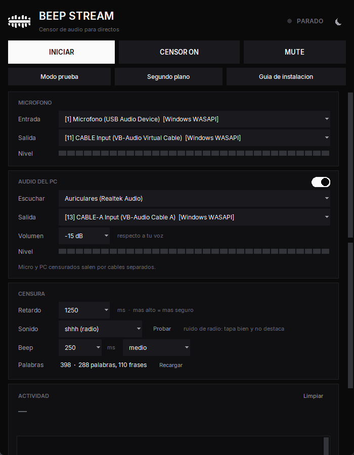
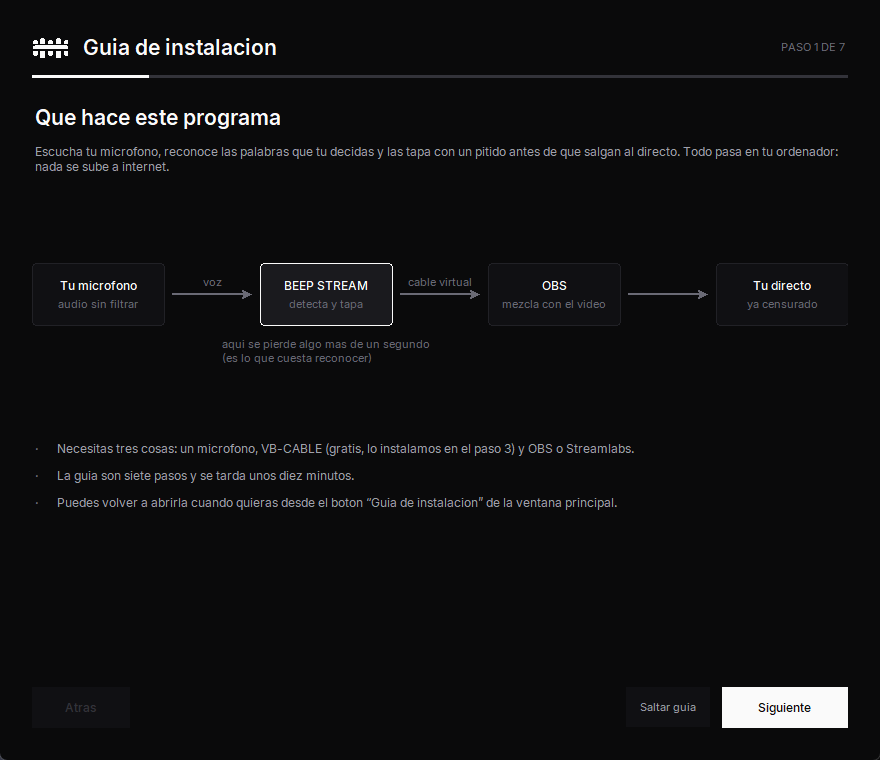
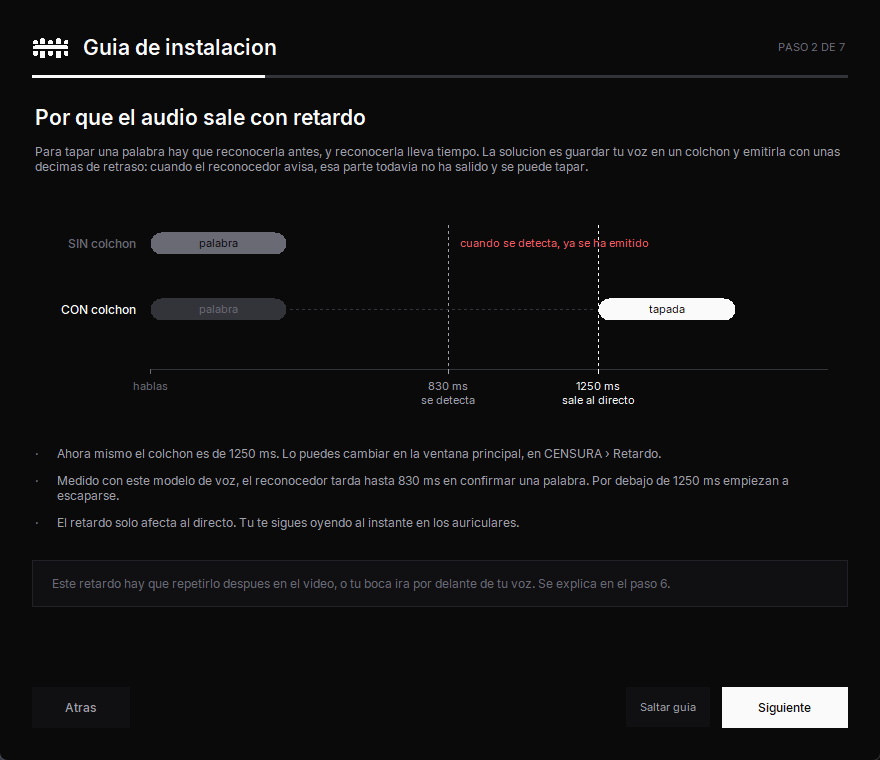
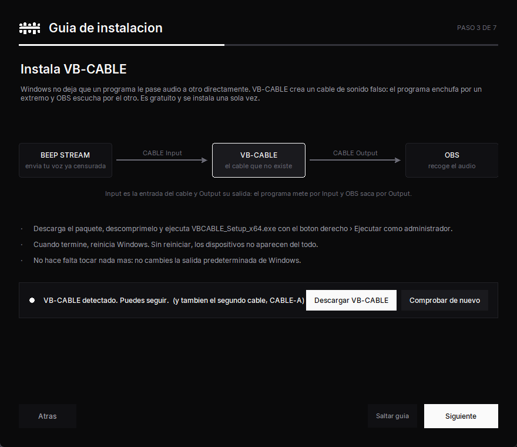
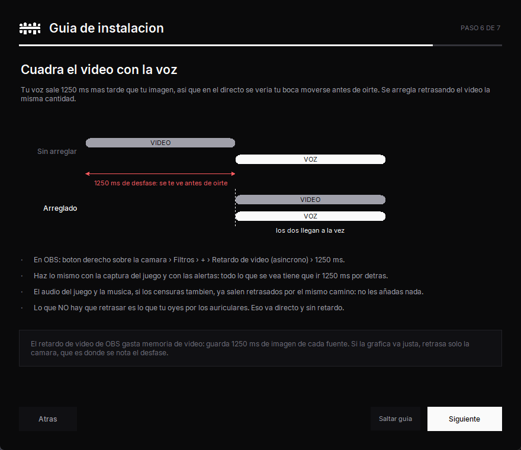

<p align="center">
  
</p>

<p align="center">
  <strong>Censor de audio en tiempo real para directos.</strong><br>
  Reconocimiento de voz offline, deteccion por debajo del segundo, sin que el audio salga del ordenador.
</p>

<p align="center">
  <a href="#como-funciona">Como funciona</a> ·
  <a href="#instalacion">Instalacion</a> ·
  <a href="#uso-diario">Uso diario</a> ·
  <a href="#tus-palabras">Tus palabras</a> ·
  <a href="#problemas">Problemas</a> ·
  <a href="README.md">English</a>
</p>

---

Un insulto en directo puede costar un canal. Cuando la emision *es* el producto,
no hay postproduccion donde meter el pitido. BEEP STREAM se coloca entre el
microfono y el programa de emision, escucha cada palabra y tapa las que tu
decidas con un sonido suave, antes de que lleguen a nadie.

Todo se ejecuta en local y en CPU. Sin API, sin cuenta, sin conexion.

<p align="center">
  
  
</p>

---

## Como funciona

Windows no deja meter un programa entre un microfono y otra aplicacion, asi que
el audio da un rodeo por un cable virtual:

```
microfono ──► BEEP STREAM ──► CABLE Input ══╗
                                            ║  VB-CABLE
              OBS ◄── CABLE Output ═════════╝
```

Dentro, la señal se parte en dos caminos:

- El **camino del audio** guarda cada bloque que entra en un buffer circular y
  lo saca `N` milisegundos despues. Ese retardo es todo el truco: compra tiempo
  para decidir antes de que el audio salga sin remedio.
- El **camino del reconocimiento** coge una copia del mismo audio, lo baja a
  16 kHz y se lo pasa a [Vosk](https://alphacephei.com/vosk/), que devuelve cada
  palabra reconocida con su inicio y su final. Lo que coincide con la lista se
  apunta como un tramo a tapar; cuando el cursor de reproduccion llega ahi, el
  contenido del buffer se sustituye por el sonido de censura.

Los dos caminos no se bloquean entre si. El reconocimiento va en su propio hilo
y se comunica por una lista de tramos sin cerrojos, de forma que una
transcripcion lenta se traduce en una palabra que se escapa, nunca en un corte
en la emision.

---

## Instalacion

### Si solo quieres usarlo

Descarga el instalador de [Releases](../../releases) y ejecutalo. No pide
permisos de administrador, crea los accesos directos y deja su desinstalador.

La primera vez que lo abras se abre sola una guia que lo explica todo paso a
paso y con dibujos: que es VB-CABLE, por que hay retardo, que tocar en OBS y
como cuadrar el video con la voz.

Ademas necesitaras [VB-CABLE](https://vb-audio.com/Cable/), que es gratuito. La
guia comprueba si ya lo tienes y te lleva a el si no.

### Desde el codigo

```bash
git clone https://github.com/airamfuentes/beep-stream
cd beep-stream
instalar.bat          # dependencias + modelo de espanol de Vosk (~40 MB)
BeepStream.bat        # arrancar
```

Hace falta Python 3.11 en Windows 10 o posterior.

### Generar el instalador

```bash
construir.bat                  # PyInstaller + Inno Setup → publicar\
construir.bat sininstalador    # solo la carpeta portable
```

Si falta Inno Setup, el script lo instala con winget.

---

## La guia de primer arranque

Hay tres cosas de este montaje que no se adivinan solas: que hace falta un cable
de audio virtual, que el audio sale con mas de un segundo de retardo, y que ese
mismo retardo hay que repetirlo en el video o la boca deja de cuadrar con la
voz. Un muro de texto lo explica mal, asi que la primera vez que se abre el
programa hay siete pasos, cada uno con su diagrama dibujado, y lo que se puede
comprobar se comprueba en vivo.

<p align="center">
  
  
</p>

<p align="center">
  
</p>

El paso del retardo se redibuja con el valor que tengas puesto, el de VB-CABLE
detecta si el cable esta instalado y se puede volver a comprobar sin reiniciar,
y el de dispositivos abre el microfono de verdad para que el medidor se mueva
mientras hablas.

---

## Uso diario

| Boton | Que hace |
|---|---|
| **INICIAR** | arranca el censor |
| **CENSOR ON / OFF** | deja pasar el audio sin filtrar, sin parar nada |
| **MUTE** | silencia el microfono del todo |
| **Modo prueba** | graba 8 s y te deja comparar el antes y el despues sin emitir |
| **Segundo plano** | esconde la ventana en la bandeja del reloj |
| **Guia de instalacion** | vuelve a abrir la guia de los siete pasos |

Mientras emites, lo que hay que mirar es la cabecera:

| Estado | Significa |
|---|---|
| `● ACTIVO` | todo correcto, censurando |
| `● PARADO` | no hay nada en marcha |
| `○ SIN CENSURA` | el audio pasa sin filtrar (lo has apagado tu) |
| `● SILENCIADO` | el microfono esta cerrado |
| `● FALLO` | **estas emitiendo sin filtrar sin quererlo** |

El rojo es el unico color de toda la interfaz. Si algo se pinta en rojo, es que
hay que mirarlo.

### El retardo

Por defecto son 1250 ms. Es el ajuste critico: por debajo de ahi el reconocedor
no llega a tiempo y las palabras se escapan. Se cambia en **CENSURA › Retardo**.

Ese mismo retardo hay que repetirlo en el video de OBS (camara, captura de
juego, alertas) o se te vera hablar antes de oirte. El paso 6 de la guia lo
explica con un diagrama.

### Audio del PC

El interruptor de la tarjeta **Audio del PC** censura tambien lo que suena por
tus auriculares: juego, voz, musica y alertas. No hay que enrutar nada ni se
nota retardo jugando, porque el programa escucha una *copia* de lo que ya esta
sonando.

Coge la mezcla entera y no se puede separar: una cancion con una palabra de la
lista tambien se lleva su pitido. En OBS hay que quitar o silenciar la fuente
"Audio del escritorio", que es la que lleva el sonido sin censurar.

---

## Tus palabras

`palabras.txt` se abre con el bloc de notas. Una palabra o frase por linea:

```
tonto            solo "tonto"
tont*            tonto, tontos, tontaco, tonteria...
me cago en todo  tambien valen frases
# esto es un comentario
```

`palabras_seguras.txt` es lo contrario: palabras normales que suenan parecido a
una de la lista y que **no** hay que censurar. Sirve para quitar falsos
positivos sin bajar la sensibilidad general.

Al guardar cualquiera de los dos, pulsa **Recargar** en la ventana. Se aplica
sin cortar el audio y sin reiniciar nada.

### Los tres modos de deteccion

Se cambian en `config.json`, en `modo_deteccion`:

| Modo | Cuando usarlo |
|---|---|
| `estricto` | casi solo coincidencias literales; el que menos pita de mas |
| `balanceado` | por defecto; aguanta que el reconocedor oiga mal |
| `agresivo` | ante la duda, pita; para canales donde una sancion es cara |

---

## Problemas

**No aparece CABLE Input en el desplegable de salida**
VB-CABLE no esta instalado, o falta reiniciar Windows despues de instalarlo.

**El nivel no se mueve aunque hable**
El microfono esta silenciado (en los auriculares con brazo, subir el brazo los
silencia) o Windows no da permiso: *Configuracion › Privacidad y seguridad ›
Microfono › permitir a las aplicaciones de escritorio*.

**Se escapan palabras**
Sube el retardo. Comprueba que la palabra este en `palabras.txt` y prueba el
modo `agresivo`. Con `herramientas/medir_latencia.py` puedes calibrar el retardo
con tu propia voz.

**Pita sobre palabras normales**
Anade esa palabra a `palabras_seguras.txt` y pulsa Recargar.

**Me oigo a mi mismo con retraso**
Estas escuchando la salida del cable. La monitorizacion tiene que ir directa al
microfono, no pasar por BEEP STREAM.

**"Unanticipated host error [PaErrorCode -9999]"**
Otro programa tiene el microfono cogido en exclusiva, o unos auriculares
inalambricos se han dormido. Cierra OBS o Discord, enciendelos y reintenta. El
programa ya prueba el mismo aparato por todas las APIs de Windows antes de
rendirse.

**El antivirus se queja del .exe**
Es normal con ejecutables de PyInstaller sin firma digital. El codigo esta
entero aqui y se puede compilar uno mismo con `construir.bat`.

---

## Como esta montado

```
main.py            arranque, argumentos, modo consola
├── gui.py         ventana principal
│   ├── widgets.py componentes con tema (tarjetas, botones, medidores)
│   ├── tema.py    paleta monocroma, escala tipografica y espaciado
│   ├── marca.py   geometria del logo, compartida con el generador de iconos
│   ├── fuentes.py carga Inter solo para el proceso, sin instalarla
│   └── asistente.py   guia de primer arranque, diagramas en lienzo
├── engine.py      buffer circular, nucleo del censor, motor del microfono
├── escritorio.py  segundo motor: audio del PC por loopback de WASAPI
├── recognizer.py  envoltorio de Vosk, decimacion y ganancia
├── matcher.py     coincidencia fonetica y lista de palabras seguras
├── beeper.py      sintesis del sonido de censura (6 estilos) y WAV
├── dispositivos.py  resolucion de dispositivos entre MME/DirectSound/WASAPI
├── bandeja.py     icono de bandeja con Win32 puro, sin dependencias
├── config.py      config.json con valores por defecto y migracion
└── rutas.py       rutas distintas para codigo y para ejecutable empaquetado
```

La explicacion de las decisiones tecnicas (por que el retardo son 1250 ms y no
630, como se evitan los falsos positivos, por que hay dos censores
independientes) esta en el [README en ingles](README.md#the-engineering-problem).

---

## Pruebas

```bash
py -3.11 tests/test_matcher.py            # coincidencia fonetica, sin hardware
py -3.11 tests/test_engine.py             # buffer, DSP, logica de tramos
py -3.11 tests/test_falsos_positivos.py   # audita la lista real de palabras
py -3.11 tests/test_integracion.py        # audio → Vosk → deteccion → pitido
py -3.11 tests/test_audio.py              # abre dispositivos de verdad
py -3.11 tests/test_cable.py              # extremo a extremo por VB-CABLE
```

Los tres primeros no necesitan ni microfono ni modelo.

---

## Privacidad

El reconocimiento es offline y funciona sin conexion. No se graba ni se envia
nada. Los unicos ficheros que se escriben son `config.json` y, si usas el modo
prueba, dos `.wav` que puedes borrar cuando quieras.

---

## Licencia

[MIT](LICENSE).

Incluye [Inter](https://rsms.me/inter/) bajo SIL Open Font License.
Reconocimiento de voz con [Vosk](https://alphacephei.com/vosk/) (Apache 2.0).
VB-CABLE es una descarga gratuita aparte de
[VB-Audio](https://vb-audio.com/Cable/) y no se redistribuye aqui.
